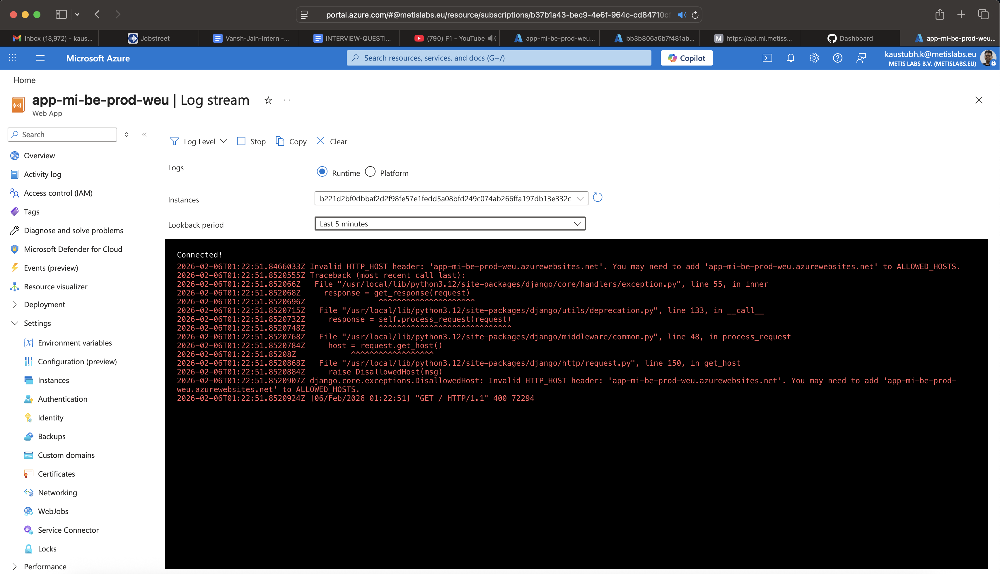
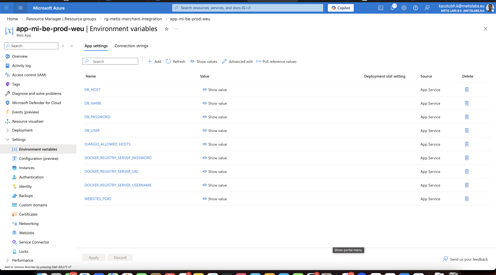

# Metis Orchestrate Backend

## Virtual Environment

Create venv:

```bash
python -m venv .venv
```

If `python` is unavailable, use `python3`.

Activate:

Linux/macOS:

```bash
source .venv/bin/activate
```

Windows PowerShell:

```powershell
.\.venv\Scripts\Activate.ps1
```

## Install Packages With `pipin`

The wrapper installs packages and regenerates `requirements.txt` using `pip-chill`.

```bash
python common_utils/scripts/pipin.py django djangorestframework
```

## Install Existing Dependencies

```bash
python -m pip install -r requirements.txt
```

## Optional `pipin` Shortcut

Linux/macOS:

```bash
alias pipin='python /path/to/ml-orchestrate/backend/common_utils/scripts/pipin.py'
```

Windows PowerShell:

```powershell
function pipin { python C:\path\to\ml-orchestrate\backend\common_utils\scripts\pipin.py $args }
```

## Run Locally

```bash
cd metis-orchestrate
python manage.py migrate
python manage.py runserver 127.0.0.1:8001
```

## OpenAPI / Swagger

After starting the backend server:

- OpenAPI schema: `http://127.0.0.1:8001/api/v1/schema/`
- Swagger UI: `http://127.0.0.1:8001/api/v1/swagger/`

Optional async worker processes (for queued scenario runs and schedule polling):

```bash
cd metis-orchestrate
celery -A core worker -l info --concurrency=2
celery -A core beat -l info
```

## Bootstrap MVP User + Required Identity Data

Run this once after migrations to create/update a working login user and required
tenant/workspace/role data for Metis Orchestrate MVP:

```bash
cd metis-orchestrate
./scripts/bootstrap_mvp_user.sh
```

Default seeded credentials:
- Email: `deepak.kushwaha@metislabs.eu`
- Password: `Admin@123456`

Environment overrides:

```bash
BOOTSTRAP_EMAIL=you@company.com \
BOOTSTRAP_PASSWORD='StrongPass@1234' \
BOOTSTRAP_TENANT_NAME='Metis Orchestrate' \
BOOTSTRAP_WORKSPACE_NAME='Metis Orchestrate Workspace' \
./scripts/bootstrap_mvp_user.sh
```

## Environment Settings

Shared backend env variables are loaded from `backend/.env`.

For scenario graph validation:

```bash
ORCHESTRATE_ALLOW_CYCLES=false
ORCHESTRATE_HTTP_TIMEOUT_SECONDS=30
ORCHESTRATE_EMAIL_TIMEOUT_SECONDS=30
ORCHESTRATE_SECRET_ENCRYPTION_ENABLED=true
ORCHESTRATE_SECRET_ENCRYPTION_KEY=<32-byte-fernet-key-or-passphrase>
ORCHESTRATE_SCHEDULE_SCAN_INTERVAL_SECONDS=60
ORCHESTRATE_STALE_QUEUED_RUN_SECONDS=1800
ORCHESTRATE_STALE_RUNNING_RUN_SECONDS=900
CELERY_BROKER_URL=redis://redis:6379/0
CELERY_RESULT_BACKEND=redis://redis:6379/1
CELERY_TASK_ALWAYS_EAGER=false
CELERY_WORKER_CONCURRENCY=2
CELERY_TASK_TIME_LIMIT=300
CELERY_TASK_SOFT_TIME_LIMIT=270
JIRA_OAUTH_AUTHORIZE_URL=https://auth.atlassian.com/authorize
JIRA_OAUTH_TOKEN_URL=https://auth.atlassian.com/oauth/token
JIRA_OAUTH_ACCESSIBLE_RESOURCES_URL=https://api.atlassian.com/oauth/token/accessible-resources
JIRA_OAUTH_CLIENT_ID=<atlassian-client-id>
JIRA_OAUTH_CLIENT_SECRET=<atlassian-client-secret>
JIRA_OAUTH_REDIRECT_URI=http://localhost:3000/dashboard/integrations/jira/oauth-callback
JIRA_OAUTH_SCOPES=read:jira-user,read:jira-work,write:jira-work,offline_access
JENKINS_OAUTH_AUTHORIZE_URL=https://<your-provider>/oauth/authorize
JENKINS_OAUTH_TOKEN_URL=https://<your-provider>/oauth/token
JENKINS_OAUTH_CLIENT_ID=<client-id>
JENKINS_OAUTH_CLIENT_SECRET=<client-secret>
JENKINS_OAUTH_REDIRECT_URI=http://localhost:3000/dashboard/integrations/jenkins/oauth-callback
JENKINS_OAUTH_SCOPES=read,write
```

One-time optional backfill command to migrate existing plaintext connection secrets:

```bash
cd metis-orchestrate
python manage.py backfill_connection_secrets
```

## Azure App Service Logs (If Using Azure)

Enable container logging:

```bash
az webapp log config \
  --name app-mi-be-prod-weu \
  --resource-group rg-metis-merchant-integration \
  --docker-container-logging filesystem
```

Tail logs:

```bash
az webapp log tail \
  --name app-mi-be-prod-weu \
  --resource-group rg-metis-merchant-integration
```

Portal log stream:
[Log Stream - app-mi-be-prod-weu](https://portal.azure.com/#@metislabs.eu/resource/subscriptions/b37b1a43-bec9-4e6f-964c-cd84710cfac6/resourceGroups/rg-metis-merchant-integration/providers/Microsoft.Web/sites/app-mi-be-prod-weu/logStream)

Screenshot reference:


Download recent logs:

```bash
az webapp log download \
  --name app-mi-be-prod-weu \
  --resource-group rg-metis-merchant-integration \
  --log-file /tmp/appservice-logs.zip
```

## Production Secrets (Azure)

Update App Service environment variables in the Azure Portal and share updates
with DevOps as needed.

Portal link:
[Azure App Service Environment Variables](https://portal.azure.com/#@metislabs.eu/resource/subscriptions/b37b1a43-bec9-4e6f-964c-cd84710cfac6/resourceGroups/rg-metis-merchant-integration/providers/Microsoft.Web/sites/app-mi-be-prod-weu/environmentVariablesAppSettings)

Screenshot reference:

